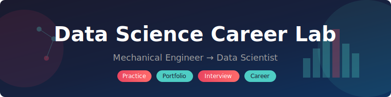

<p align="center">
  
</p>

<h1 align="center">DSAI Roadmap</h1>

<p align="center">
  <strong>Data Science & AI Learning Journey</strong><br>
  Mechanical Engineer → Data Scientist | Feb - June 2026
</p>

<p align="center">
  <a href="#-quick-navigation">Navigation</a> •
  <a href="#-current-status">Status</a> •
  <a href="#-practice-lab">Practice</a> •
  <a href="#-portfolio">Portfolio</a> •
  <a href="#-knowledge-base">Knowledge Base</a> •
  <a href="#-career-outlook">AI & Career</a>
</p>

---

## Quick Navigation

| Section | Purpose | Start Here |
|---------|---------|------------|
| [Practice Lab](#-practice-lab) | Daily skill building | `practice/sql/01_basics_exercises.md` |
| [Portfolio](#-portfolio) | Job-ready projects | `projects/manufacturing-chatbot/` |
| [Knowledge Base](#-knowledge-base) | Reference & learning | `knowledge/` |
| [Interview Prep](#-interview-prep) | Technical interviews | `practice/interview-prep/` |
| [AI Career Outlook](#-will-ai-replace-data-scientists) | Future-proofing | This section |

---

## Current Status

**Timeline:** Feb - June 2026
**Target Role:** Data Scientist (Manufacturing/Industrial Analytics)
**Competitive Edge:** Engineering domain expertise + AI fluency

```
SKILL TRACK           PROGRESS    STATUS
────────────────────────────────────────────────
SQL Fundamentals      ████░░░░░░  40% - In Progress
Python/NumPy          ███░░░░░░░  30% - Basics done
Pandas                ░░░░░░░░░░   0% - Not started
ML Fundamentals       ░░░░░░░░░░   0% - Not started
Portfolio Project     ░░░░░░░░░░   0% - Planning
Interview Prep        █░░░░░░░░░  10% - Questions ready
Networking            ░░░░░░░░░░   0% - LinkedIn updated
```

### This Week's Focus
- [ ] Complete SQL Level 1-4 exercises
- [ ] Start Python/NumPy exercises
- [ ] Outline manufacturing chatbot project

---

## Practice Lab

> **Workflow:** Read exercise → Write solution → Run with Claude Code → Debug → Master

### Tracks

| Track | Location | Exercises | Status |
|-------|----------|-----------|--------|
| **SQL** | `practice/sql/` | 21 exercises (8 levels) | In Progress |
| **Python** | `practice/python/` | 6 exercises | Ready |
| **NumPy** | `practice/numpy/` | 6 exercises | Ready |
| **Pandas** | `practice/pandas/` | 8 exercises | Ready |
| **ETL** | `practice/etl/` | 5 exercises | Ready |
| **ML** | `practice/ml/` | 6 exercises | Ready |
| **Interview** | `practice/interview-prep/` | 25+ questions | Ready |

### Quick Start

```bash
# 1. Navigate to a track
cd practice/sql

# 2. Read the exercise file
# Open 01_basics_exercises.md

# 3. Write your solution
# Edit 01_my_solutions.sql

# 4. Ask Claude Code to run it
# "Run exercise 1.1"
```

### Skill Checklist

<details>
<summary><strong>SQL Mastery Path</strong></summary>

**Level 1-4: Fundamentals**
- [ ] SELECT, WHERE, ORDER BY
- [ ] GROUP BY, HAVING
- [ ] COUNT, SUM, AVG, MIN, MAX
- [ ] LIMIT, OFFSET

**Level 5-8: Intermediate**
- [ ] INNER JOIN
- [ ] LEFT/RIGHT JOIN
- [ ] Self JOIN
- [ ] Multiple table JOINs

**Level 9-12: Advanced**
- [ ] Subqueries (scalar, correlated)
- [ ] CTEs (WITH clause)
- [ ] Window functions (ROW_NUMBER, RANK, LEAD, LAG)
- [ ] PARTITION BY

</details>

<details>
<summary><strong>Python Mastery Path</strong></summary>

- [ ] List/dict comprehensions
- [ ] Functions, *args, **kwargs
- [ ] Error handling (try/except)
- [ ] File I/O
- [ ] Classes and OOP basics
- [ ] Type hints

</details>

<details>
<summary><strong>Data Science Stack</strong></summary>

**NumPy**
- [ ] Array creation and indexing
- [ ] Broadcasting
- [ ] Aggregations
- [ ] Boolean masking

**Pandas**
- [ ] DataFrame creation and selection
- [ ] Filtering and sorting
- [ ] GroupBy operations
- [ ] Merge, join, concat
- [ ] Pivot tables
- [ ] Handling missing data

**Visualization**
- [ ] Matplotlib basics
- [ ] Seaborn for statistical plots
- [ ] Plotly for interactive

</details>

---

## Monthly Plan

### FEBRUARY - Foundation
**Goal:** SQL proficiency + practice workflow mastery

- [ ] Complete SQL exercises Level 1-8
- [ ] 30 HackerRank SQL problems (Easy → Medium)
- [ ] Complete Python/NumPy exercises
- [ ] Define manufacturing chatbot scope

### MARCH - Portfolio Build
**Goal:** Ship portfolio project #1

- [ ] Manufacturing chatbot MVP
- [ ] RAG implementation with ChromaDB
- [ ] Streamlit deployment
- [ ] 60-second demo video
- [ ] 5 networking conversations

### APRIL - Interview Ready
**Goal:** Technical interview confidence

- [ ] SQL Medium problems fluently
- [ ] Complete interview prep question bank
- [ ] 3+ mock interviews
- [ ] Second portfolio project (course capstone)

### MAY-JUNE - Job Hunt
**Goal:** Secure first offer

- [ ] 50-100 applications
- [ ] 10+ referral requests
- [ ] Resume + portfolio polished
- [ ] Offer negotiation

---

## Portfolio

### Project 1: Manufacturing Defect Analysis Chatbot

**Why This Project:**
- Leverages ME background (domain expertise)
- Demonstrates LLM/RAG skills (hot market)
- Solves real manufacturing problem
- Unique positioning vs. generic DS projects

**Tech Stack:**
- Python + Streamlit
- OpenAI/Claude API
- ChromaDB (vector storage)
- Pandas (data manipulation)

**Location:** `projects/manufacturing-chatbot/`

**Status:** Planning Phase

### Project 2: Course Capstone

ML fundamentals project from data science coursework.

**Location:** `projects/course-capstone/`

**Status:** Not Started

---

## Knowledge Base

> Your second brain for data science concepts, organized for quick reference.

### Structure

```
knowledge/
├── concepts/           # Core DS/ML concepts explained
│   ├── statistics.md
│   ├── ml-fundamentals.md
│   └── llm-basics.md
├── tools/              # Tool-specific guides
│   ├── sql-cheatsheet.md
│   ├── pandas-cookbook.md
│   └── git-workflow.md
├── papers/             # Paper summaries & notes
│   └── README.md       # Reading list (15+ papers)
├── career/             # Job search resources
│   ├── resume-template.md
│   ├── interview-questions.md
│   └── networking-scripts.md
└── logs/               # Learning journal
    └── weekly/         # Weekly reflections
```

### Key Papers Reading List

**Must Read (Priority Order):**

1. [Attention Is All You Need](https://arxiv.org/abs/1706.03762) - Transformers foundation
2. [BERT](https://arxiv.org/abs/1810.04805) - Bidirectional understanding
3. [GPT-3](https://arxiv.org/abs/2005.14165) - In-context learning
4. [InstructGPT](https://arxiv.org/abs/2203.02155) - RLHF training
5. [ReAct](https://arxiv.org/abs/2210.03629) - Agent reasoning
6. [RAG](https://arxiv.org/abs/2005.11401) - Retrieval-augmented generation

**Deeper Dives:**
- Chain-of-Thought prompting
- Constitutional AI
- LoRA fine-tuning
- Scaling laws

See `knowledge/papers/README.md` for full list.

### Curated Learning Resources

**SQL:**
- [SQLBolt](https://sqlbolt.com/) - Interactive basics
- [HackerRank SQL](https://www.hackerrank.com/domains/sql) - Practice problems
- [Mode SQL Tutorial](https://mode.com/sql-tutorial/) - Analytics focus

**Python + DS Stack:**
- [Python for Data Analysis](https://wesmckinney.com/book/) - Wes McKinney's book (free)
- [Kaggle Learn](https://www.kaggle.com/learn) - Quick interactive courses
- [Real Python](https://realpython.com/) - Deep dives

**Machine Learning:**
- [StatQuest](https://www.youtube.com/c/joshstarmer) - Visual explanations
- [Andrew Ng's ML Course](https://www.coursera.org/learn/machine-learning) - Classic foundation
- [Fast.ai](https://www.fast.ai/) - Practical deep learning

**LLMs & Modern AI:**
- [Anthropic Research](https://www.anthropic.com/research) - Frontier AI insights
- [Simon Willison's Blog](https://simonwillison.net/) - LLM practitioner perspective
- [Hugging Face Docs](https://huggingface.co/docs) - Implementation guides

**Manufacturing + AI:**
- Industry 4.0 resources
- Predictive maintenance case studies
- Quality control ML applications

---

## Interview Prep

### SQL Questions (By Difficulty)

**Easy:**
1. Second highest salary
2. Duplicate emails
3. Employees earning more than manager

**Medium:**
4. Department top earner
5. Consecutive days problem
6. Running totals (window functions)

**Hard:**
7. Median calculation
8. Year-over-year growth

### Python/Pandas Questions

1. Clean messy CSV file
2. Merge DataFrames with conflicts
3. Calculate rolling averages
4. Pivot table from raw data

### Statistics Questions

1. Explain p-value in simple terms
2. Type I vs Type II errors
3. When to use median vs mean
4. How to detect outliers
5. A/B testing interpretation

### Your Story (Behavioral)

> "I'm an mechanical engineer who's spent [X years] in manufacturing environments - I've seen firsthand how data transforms operations. At [previous role], I noticed [specific problem] and became fascinated with how predictive analytics could solve it. I've been building [portfolio project] to apply these skills. What excites me about this role is bringing domain expertise to data science - I don't just analyze the data, I understand the machines and processes generating it."

### Mock Interview Format

1. **SQL** (20 min): Live coding on whiteboard/shared screen
2. **Python** (20 min): Data manipulation problem
3. **Statistics** (15 min): Concept explanations
4. **Case Study** (30 min): Business problem analysis
5. **Behavioral** (15 min): Experience and culture fit

---

## Will AI Replace Data Scientists?

### The Research Says: No, But The Role Is Transforming

Based on analysis from [Harvard Career Services](https://careerservices.fas.harvard.edu/blog/2025/09/25/will-data-analysts-be-replaced-by-ai/), [industry reports](https://medium.com/data-science-collective/ai-and-data-scientist-job-market-in-2026-analysis-trends-opportunities-early-year-report-1641d1f8a30d), and [market data](https://iabac.org/blog/data-science-jobs):

### What's Being Automated

| Task | Before AI | After AI |
|------|-----------|----------|
| Data cleaning | 60-80% of time | Largely automated |
| Basic queries | Manual SQL | Natural language |
| Initial reports | Hours | Minutes |
| Code writing | From scratch | AI-assisted |

### What Remains Human

- **Business Context** - Understanding what questions matter
- **Domain Expertise** - Your ME background is an asset, not liability
- **Strategic Thinking** - Connecting insights to decisions
- **Stakeholder Communication** - Telling the data story
- **Ethical Oversight** - Validating AI outputs

### The Numbers

```
Job Growth:           35% this decade (far above average)
New Jobs by 2026:     11.5 million globally
Talent Shortage:      50% demand > supply in US
Salary Range:         $120K - $250K+ for experienced
```

### Your Competitive Edge

Manufacturing + AI is a high-demand intersection:

> "Domain knowledge turns AI from an experiment into a strategic asset."
> — Industry analysis, 2026

Applications where your ME background matters:
- **Defect detection** on assembly lines
- **Predictive maintenance** for equipment
- **Supply chain optimization**
- **Quality control** automation
- **Process optimization** with sensor data

### How to Future-Proof

1. **Embrace AI tools** - Use them daily, understand their limits
2. **Deepen domain expertise** - Manufacturing knowledge compounds
3. **Focus on business impact** - Not just technical skills
4. **Build communication skills** - Translate data to decisions
5. **Stay current** - Read papers, follow practitioners

### Bottom Line

The professionals who thrive will be **AI-augmented analysts** who:
- Frame the right questions (AI answers, you ask)
- Validate AI outputs (AI proposes, you verify)
- Provide domain context (AI is general, you're specific)
- Drive decisions (AI informs, you decide)

---

## Career Reality

| Year | Level | Strategy |
|------|-------|----------|
| 1 | Entry | Data Analyst / Junior DS - learn, prove yourself |
| 2-3 | Mid | Strategic hop for 30-50% raise |
| 4-5 | Senior | Specialist track or management |

**Key Insight:** First job = entry point, not destination

---

## Risks to Avoid

| Risk | Why It Hurts | Mitigation |
|------|--------------|------------|
| Projects you can't explain | Interview disaster | Build what you understand |
| Only applying to FAANG | Too competitive | Target mid-size companies first |
| Neglecting SQL | Tested in 90% of interviews | Daily practice |
| No networking | 80% of hires via referrals | 5 conversations/month |
| AI as ghost-writer | Can't perform independently | Write code yourself, use AI for review |

---

## Mantras

```
Portfolio > Certifications
Referrals > Cold Applications
Domain Expertise = Competitive Edge
First Job = Learning Opportunity
Ship > Perfect
```

---

## Repository Structure

```
DSAI-roadmap/
├── README.md                 # This file
├── practice/
│   ├── sql/                  # SQL exercises + databases
│   ├── python/               # Python fundamentals
│   ├── numpy/                # Array operations
│   ├── pandas/               # Data manipulation
│   ├── etl/                  # Data pipelines
│   ├── ml/                   # ML fundamentals
│   └── interview-prep/       # Interview questions
├── projects/
│   ├── manufacturing-chatbot/
│   └── course-capstone/
├── knowledge/
│   ├── concepts/             # Core concepts explained
│   ├── tools/                # Cheatsheets & guides
│   ├── papers/               # Paper summaries
│   ├── career/               # Job search resources
│   └── logs/                 # Learning journal
├── notebooks/
│   └── exploration/
└── assets/
```

---

## External Resources

### Top GitHub Roadmaps (Reference)

- [Data-Science-Roadmap](https://github.com/Moataz-Elmesmary/Data-Science-Roadmap) - Comprehensive A-Z guide
- [data-science-roadmap](https://github.com/ayush714/data-science-roadmap) - All-in-one resources
- [Roadmap-Docs](https://github.com/rashakil-ds/Roadmap-Docs) - Job-posting aligned roadmaps

### Daily Reads

- [Anthropic Blog](https://www.anthropic.com/research)
- [Simon Willison](https://simonwillison.net/)
- [Towards Data Science](https://towardsdatascience.com/)

---

*Last updated: February 2026*
